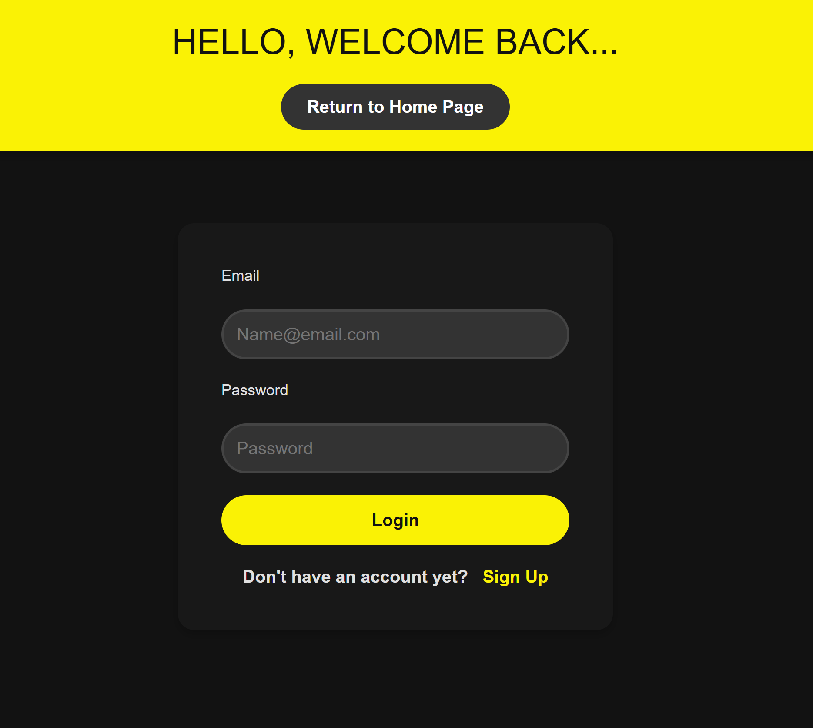
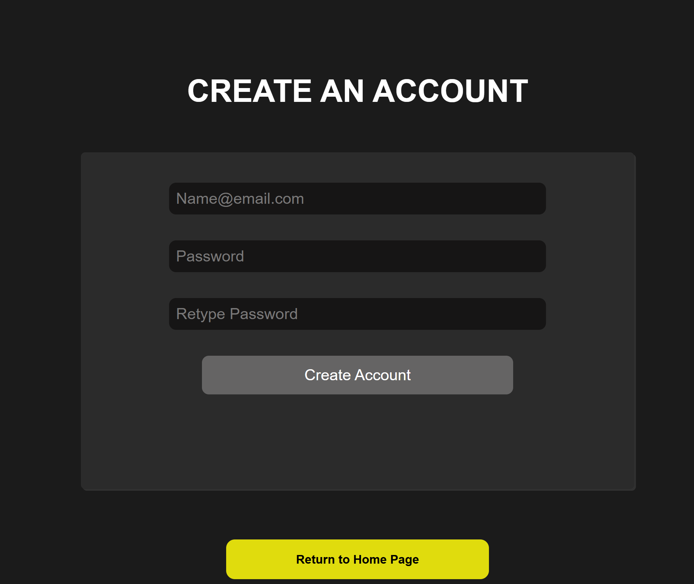
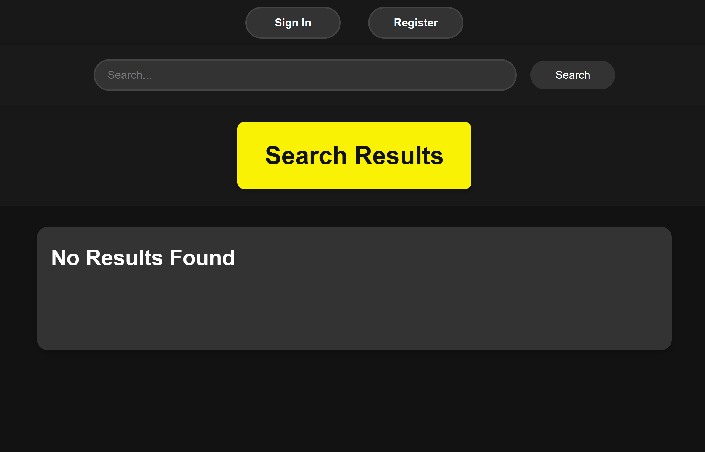

[Back to Portfolio](./)

Clinvar Project
===============

-   **Class:** CSCI 495 Systems Analysis and Software Design
-   **Grade:** 85
-   **Language(s):** Python
-   **Source Code Repository:** [ClinVar Project](https://github.com/MinhTran2398/CSCI-495-ClinVar-Project-YellowTeam)  
    (Please [email me](mailto:mtran@csustudent.net?subject=GitHub%20Access) to request access.)

## Project description

This project is a real-time file merging system developed to support a doctor at MUSC (Medical University of South Carolina). It functions as a web application designed to seamlessly integrate data from ClinVar into the website's platform. Users can create accounts, log in, and log out, with access to features that allow them to search for cancer-related variable data. The data is directly pulled and merged from ClinVar, ensuring it remains up-to-date through regular updates. This program has the potential to significantly enhance accessibility and efficiency in handling critical genetic information for medical and research purposes.

## How to compile and run the program

1. **Set Up the Environment**: Ensure you have **Visual Studio Code (VS Code)** and **Python** installed on your computer. Alternatively, you can use a local web server or application to deploy the code.

2. **Clone the Code**: Access your GitHub repository and clone the project to your local system. Use the following command:
   ```
   git clone <repository-url>
   ```
   (Please [email me](mailto:mtran@csustudent.net?subject=GitHub%20Access) to request access.)

3. **Run the Code**: Open the project in VS Code or navigate to the project directory in your terminal. Use Python to execute the required files:
   ```
   python3 <filename>
   ```
   Replace `<filename>` with the name of the main Python script for the project.
4. **Run by using PHP**
   You could use php instead of python, it will work the same.

## UI Design
This following is for login (fig 1)
Sign-up (fig2)
Main page (fig3)

  
Fig 1. Log-in

  
Fig 2. Sign up

  
Fig 2. Main page


[Back to Portfolio](./)
